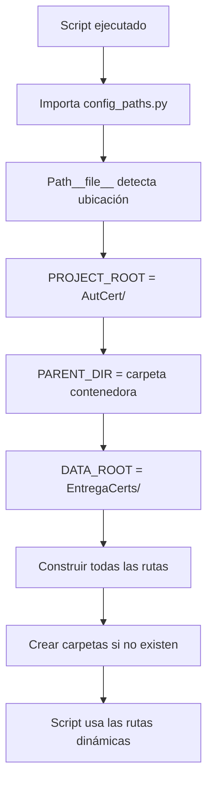

# 📁 Enrutamiento Dinámico en AutCert

## 🎯 ¿Qué es el Enrutamiento Dinámico?

El **enrutamiento dinámico** es un sistema que permite que el código encuentre automáticamente sus archivos y carpetas sin importar en qué PC o ubicación se ejecute el proyecto.

En lugar de usar rutas "hardcodeadas" como:
```python
# ❌ MAL - No funciona en otros PCs
ruta = "C:/Users/julia/Desktop/AutCert/Certificaciones"
```

Usamos rutas que se calculan automáticamente:
```python
# ✅ BIEN - Funciona en cualquier PC
ruta = PROJECT_ROOT / "Certificaciones"
```

---

## 🗂️ Estructura del Proyecto

El proyecto AutCert se organiza en **DOS carpetas separadas**:

```
📂 Cualquier ubicación en tu PC/
│
├── 📂 EntregaCerts/                    ← CARPETA DE DATOS (Se crea automáticamente)
│   ├── 📂 Certificaciones/
│   │   ├── 📂 AyN/
│   │   ├── 📂 RyC/
│   │   └── 📂 Transversal/
│   │
│   ├── 📂 Certificaciones_PDF/
│   │   ├── 📂 AyN/
│   │   ├── 📂 RyC/
│   │   └── 📂 Transversal/
│   │
│   └── 📂 Evidencias/
│
└── 📂 AutCert/                         ← CARPETA DEL PROYECTO (Código fuente)
    ├── 📄 config_paths.py              ← Configuración de rutas
    ├── 📄 README.md
    ├── 📂 Modulos/
    │   ├── 📂 Links_Drive/
    │   ├── 📂 Evidencias_Azure/
    │   ├── 📂 Conversion_PDF/
    │   ├── 📂 Renombrado/
    │   └── 📂 Analisis/
    ├── 📂 Assets/
    │   ├── 📂 Base de datos/
    │   │   └── 📄 data.csv
    │   └── 📂 Reportes/
    └── 📂 Logs/
```

---

## ⚙️ ¿Cómo Funciona el Enrutamiento Dinámico?

### Paso 1: Detectar la Ubicación del Código

El archivo `config_paths.py` usa Python para detectar dónde está ubicado:

```python
# 1. Detectar dónde está este archivo (config_paths.py)
PROJECT_ROOT = Path(__file__).parent.resolve()
# Resultado: C:/Users/Julian/Proyectos/AutCert
```

**¿Qué hace `Path(__file__)`?**
- `__file__` es una variable especial de Python que contiene la ruta del archivo actual
- `Path()` convierte la ruta en un objeto Path de pathlib
- `.parent` sube un nivel en la estructura de carpetas
- `.resolve()` convierte la ruta en una ruta absoluta completa

### Paso 2: Encontrar la Carpeta Contenedora

Una vez que sabemos dónde está `AutCert/`, subimos un nivel:

```python
# 2. Subir un nivel para encontrar la carpeta contenedora
PARENT_DIR = PROJECT_ROOT.parent
# Resultado: C:/Users/Julian/Proyectos
```

### Paso 3: Definir la Carpeta de Datos

Desde la carpeta contenedora, definimos `EntregaCerts` como carpeta hermana:

```python
# 3. Definir la carpeta de datos (hermana de AutCert)
DATA_ROOT = PARENT_DIR / "EntregaCerts"
# Resultado: C:/Users/Julian/Proyectos/EntregaCerts
```

### Paso 4: Construir Todas las Rutas

Ahora todas las rutas se construyen desde estas bases:

```python
# Rutas en la carpeta de código
LOGS_DIR = PROJECT_ROOT / "Logs"
# Resultado: C:/Users/Julian/Proyectos/AutCert/Logs

# Rutas en la carpeta de datos
CERTIFICACIONES_ROOT = DATA_ROOT / "Certificaciones"
# Resultado: C:/Users/Julian/Proyectos/EntregaCerts/Certificaciones

EVIDENCIAS_ROOT = DATA_ROOT / "Evidencias"
# Resultado: C:/Users/Julian/Proyectos/EntregaCerts/Evidencias

PDF_ROOT = DATA_ROOT / "Certificaciones_PDF"
# Resultado: C:/Users/Julian/Proyectos/EntregaCerts/Certificaciones_PDF
```

---

## 🌍 Portabilidad Entre PCs

### Ejemplo 1: PC de Julian

```
C:/Users/Julian/Proyectos/
├── EntregaCerts/          ← Se crea aquí automáticamente
└── AutCert/               ← Código
```

**Rutas resultantes:**
- `PROJECT_ROOT` = `C:/Users/Julian/Proyectos/AutCert`
- `DATA_ROOT` = `C:/Users/Julian/Proyectos/EntregaCerts`
- `CERTIFICACIONES_ROOT` = `C:/Users/Julian/Proyectos/EntregaCerts/Certificaciones`

### Ejemplo 2: PC de María

```
D:/Trabajo/MisProyectos/
├── EntregaCerts/          ← Se crea aquí automáticamente
└── AutCert/               ← Código
```

**Rutas resultantes:**
- `PROJECT_ROOT` = `D:/Trabajo/MisProyectos/AutCert`
- `DATA_ROOT` = `D:/Trabajo/MisProyectos/EntregaCerts`
- `CERTIFICACIONES_ROOT` = `D:/Trabajo/MisProyectos/EntregaCerts/Certificaciones`

### Ejemplo 3: En el escritorio

```
C:/Users/Pedro/Desktop/
├── EntregaCerts/          ← Se crea aquí automáticamente
└── AutCert/               ← Código
```

**Rutas resultantes:**
- `PROJECT_ROOT` = `C:/Users/Pedro/Desktop/AutCert`
- `DATA_ROOT` = `C:/Users/Pedro/Desktop/EntregaCerts`
- `CERTIFICACIONES_ROOT` = `C:/Users/Pedro/Desktop/EntregaCerts/Certificaciones`

---

## 🔄 Flujo Completo de Detección



---

## 📝 Cómo Cada Script Importa las Rutas

Todos los scripts del proyecto siguen este patrón:

```python
from pathlib import Path
import sys

# 1. Calcular la raíz del proyecto desde la ubicación del script
PROJECT_ROOT = Path(__file__).parent.parent.parent.resolve()
# (Cantidad de .parent depende de qué tan profundo está el script)

# 2. Añadir la raíz al sys.path para poder importar config_paths
if str(PROJECT_ROOT) not in sys.path:
    sys.path.insert(0, str(PROJECT_ROOT))

# 3. Importar las rutas centralizadas
from config_paths import CSV_PATH_STR, CERTIFICACIONES_ROOT_STR, PDF_ROOT_STR

# 4. Usar las rutas
CSV_PATH = CSV_PATH_STR
```

### Ejemplo: Script en Modulos/Conversion_PDF/convertir_a_pdf.py

```python
# Script está en: AutCert/Modulos/Conversion_PDF/convertir_a_pdf.py

# Para llegar a AutCert/ desde aquí:
# convertir_a_pdf.py -> Conversion_PDF -> Modulos -> AutCert
PROJECT_ROOT = Path(__file__).parent.parent.parent.resolve()
#                      ↑         ↑         ↑
#                      1         2         3 niveles arriba
```

---

## ✅ Beneficios del Enrutamiento Dinámico

### 1. **Portabilidad Total**
- ✅ Funciona en cualquier PC
- ✅ Funciona en cualquier ubicación (Escritorio, Documentos, USB, etc.)
- ✅ No requiere configuración manual

### 2. **Separación de Código y Datos**
- ✅ Código (AutCert/) se puede versionar en Git fácilmente
- ✅ Datos (EntregaCerts/) se mantienen separados
- ✅ Fácil hacer backup del código sin archivos pesados

### 3. **Múltiples Instalaciones**
- ✅ Puedes tener varias copias del código
- ✅ Todas pueden apuntar a la misma carpeta EntregaCerts
- ✅ O cada una puede tener su propia carpeta de datos

### 4. **Creación Automática**
- ✅ Al ejecutar cualquier script, las carpetas se crean automáticamente
- ✅ No necesitas crearlas manualmente
- ✅ Estructura siempre consistente

---

## 🚀 Cómo Usar el Proyecto

### Instalación Inicial

1. **Copia la carpeta AutCert** a cualquier ubicación:
   ```
   Ejemplo: C:/MisProyectos/AutCert
   ```

2. **Ejecuta cualquier script**:
   ```bash
   python Modulos/Conversion_PDF/convertir_a_pdf.py
   ```

3. **La carpeta EntregaCerts se crea automáticamente** al lado de AutCert:
   ```
   C:/MisProyectos/
   ├── EntregaCerts/     ← Se creó automáticamente
   └── AutCert/          ← Tu código
   ```

### Mover el Proyecto

1. **Corta/Pega ambas carpetas** a la nueva ubicación:
   ```
   De:   C:/MisProyectos/
   A:    D:/Trabajo/
   ```

2. **Todo sigue funcionando** sin cambios:
   - Los scripts detectan automáticamente la nueva ubicación
   - Las rutas se recalculan dinámicamente
   - No hay que editar ningún archivo

---

## 🔧 Configuración Avanzada

### ¿Y si quiero cambiar la estructura?

Si necesitas cambiar dónde se guardan los datos, edita `config_paths.py`:

```python
# Opción 1: Carpeta de datos en ubicación fija
DATA_ROOT = Path("D:/DatosCertificaciones")

# Opción 2: Carpeta de datos en el home del usuario
DATA_ROOT = Path.home() / "AutCert_Datos"

# Opción 3: Usar variable de entorno
import os
DATA_ROOT = Path(os.getenv('AUTCERT_DATA', PARENT_DIR / "EntregaCerts"))
```

---

## 📊 Comparación: Antes vs Después

### ❌ Antes (Rutas Hardcodeadas)

```python
# convertir_a_pdf.py
CERTIFICACIONES_ROOT = r"C:\Users\julia\Desktop\AutCert\Certificaciones"
PDF_ROOT = r"C:\Users\julia\Desktop\AutCert\Certificaciones_PDF"

# Problemas:
# - Solo funciona en el PC de julia
# - Solo funciona si está en el Desktop
# - Hay que editar cada archivo al mover el proyecto
```

### ✅ Después (Rutas Dinámicas)

```python
# convertir_a_pdf.py
from config_paths import CERTIFICACIONES_ROOT_STR, PDF_ROOT_STR

CERTIFICACIONES_ROOT = CERTIFICACIONES_ROOT_STR
PDF_ROOT = PDF_ROOT_STR

# Ventajas:
# - Funciona en cualquier PC
# - Funciona en cualquier ubicación
# - No hay que editar nada al mover el proyecto
# - Todo centralizado en config_paths.py
```

---

## 🎓 Conceptos Clave de Python

### `Path(__file__)`
- `__file__`: Variable especial que contiene la ruta del archivo Python actual
- `Path()`: Clase de pathlib para manejar rutas de forma elegante y multi-plataforma

### `.parent`
- Obtiene la carpeta padre de una ruta
- Se puede encadenar: `.parent.parent.parent` sube 3 niveles

### `.resolve()`
- Convierte una ruta relativa en absoluta
- Resuelve enlaces simbólicos
- Ejemplo: `../carpeta` → `C:/Users/Julian/carpeta`

### Operador `/`
- En pathlib, el `/` une rutas de forma segura
- Funciona en Windows, Linux y Mac
- Ejemplo: `Path("C:/Users") / "Julian" / "Documentos"`
  - Resultado: `C:/Users/Julian/Documentos`

---

## 🆘 Solución de Problemas

### "No se encuentra el archivo CSV"

**Causa:** El archivo `data.csv` no está en `Assets/Base de datos/`

**Solución:**
1. Verifica que el archivo existe: `AutCert/Assets/Base de datos/data.csv`
2. Si no existe, copia tu CSV a esa ubicación
3. El script mostrará la ruta exacta donde lo está buscando

### "No se crean las carpetas en EntregaCerts"

**Causa:** Permisos de escritura o ruta inválida

**Solución:**
1. Verifica que tienes permisos de escritura en la carpeta padre
2. Ejecuta el script manualmente para ver errores:
   ```bash
   python -c "from config_paths import crear_directorios; crear_directorios()"
   ```

### "ImportError: cannot import name 'config_paths'"

**Causa:** Python no encuentra `config_paths.py`

**Solución:**
1. Verifica que ejecutas el script desde la estructura correcta
2. El script debe estar dentro de `AutCert/` o sus subcarpetas
3. Revisa que el código de detección de `PROJECT_ROOT` sea correcto

---

## 📚 Recursos Adicionales

- [Documentación de pathlib](https://docs.python.org/3/library/pathlib.html)
- [Python __file__ variable](https://docs.python.org/3/reference/datamodel.html)
- [sys.path en Python](https://docs.python.org/3/library/sys.html#sys.path)

---

**Última actualización:** 2026-01-13
**Versión:** 2.0 - Enrutamiento Dinámico con carpeta externa
